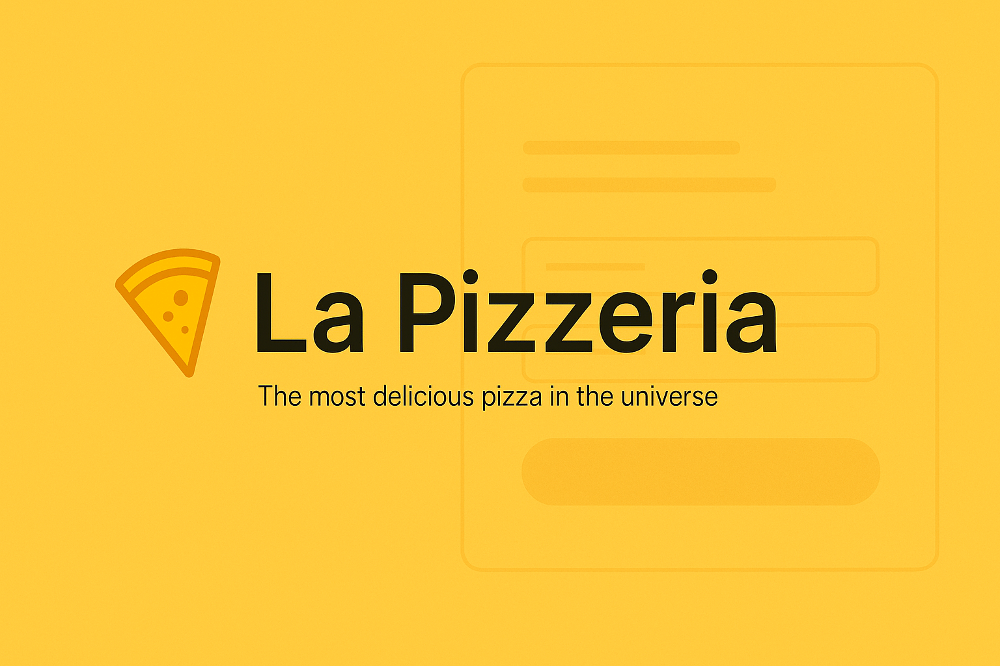
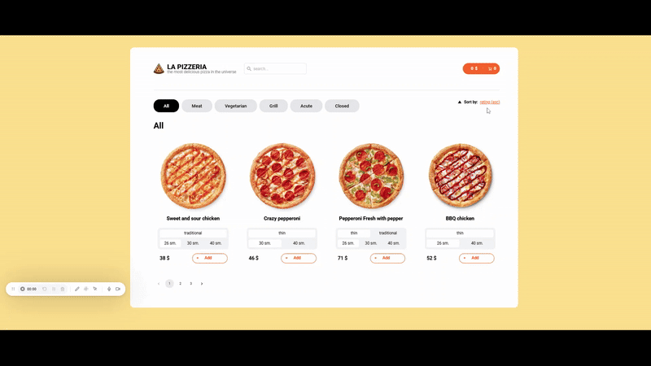
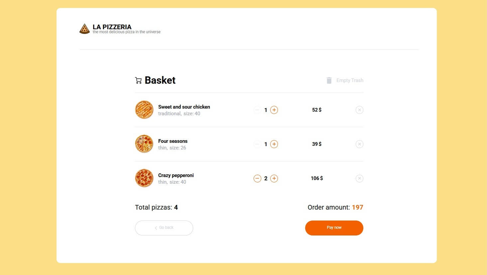
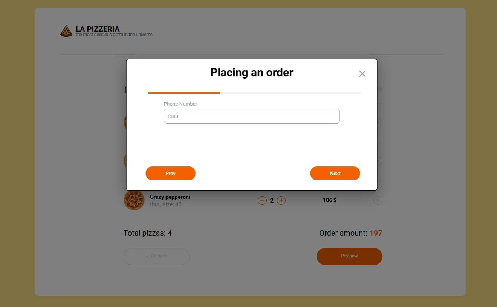
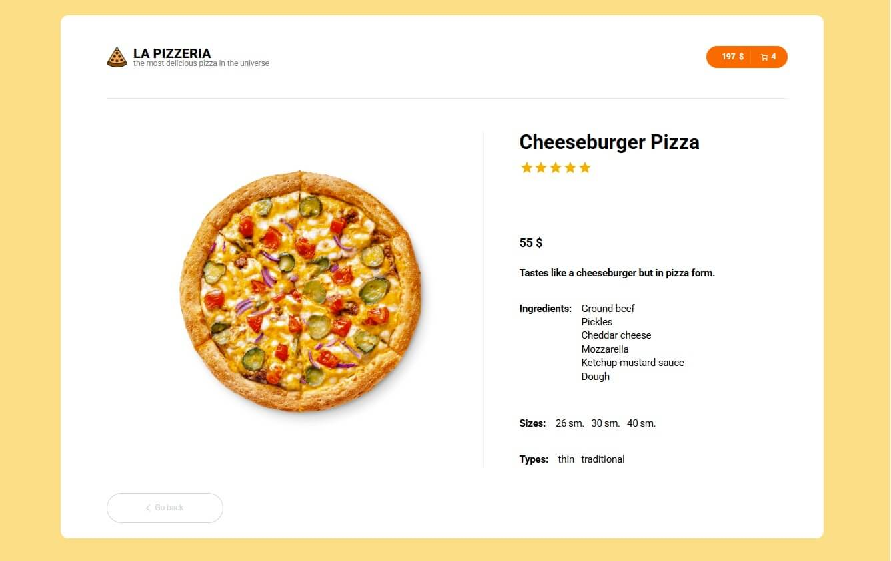

<p align="center">
  
</p>

# 🍕 La Pizzeria

[🌐 Live Demo](https://la-pizzeria-yurii-dano.vercel.app/)

**La Pizzeria** is a modern single-page pizza ordering application featuring a responsive interface, interactive cart, step-by-step order process, and real-time pricing.

## 👨‍💻 About This Project
I implemented this project entirely on my own, from layout and logic to full front-end implementation. The project demonstrates the functionality of online pizza ordering as part of my portfolio.

The user interface design was based on an existing concept, but the entire layout structure, adaptability, logic, and integration were implemented by me from scratch.

It uses a mock API service ([mockapi.io](https://mockapi.io/)) to simulate pizza items, cart management, and order processing, focusing on frontend logic and user experience.

I implemented:
  - Step-by-step order form with validation and progress tracking
  - State management using Redux Toolkit (cart, order form)
  - Saving form state, active step in localStorage
  - Lazy loading for less critical pages (pizza details, cart)
  - Fully responsive layout with Tailwind CSS

---

## 📽️ Live Preview



---

## 📸 Screenshots

### 🏠 Home Page


### 🛒 Cart Page


### 🧾 Order Form


### 🍕 Pizza Details


---

## 🚀 Features

- 📦 Cart with add/edit/remove functionality
- 🧾 Step-by-step modal order form with progress indicator
- 💾 LocalStorage for form data, cart, and order step
- 💸 Real-time pizza price updates based on crust and size
- ↕️ Sort by alphabet, rating, type and price
- 🔎 Optimized search input using `lodash.debounce` to reduce server requests and unnecessary re-renders
- 🔃 Lazy loading for Cart and Pizza pages
- 🔗 Integration with the mockapi.io API service — [mockapi.io](https://mockapi.io/), including:
    - Retrieving, sorting and filtering pizzas іdata
    - Creating and processing orders
- 🧑‍💻 Fully responsive and mobile-friendly design

---

## 🛠️ Tech Stack

- **React**
- **Redux Toolkit** + **RTK Query**
- **React Router**
- **Axios**
- **React Hook Form**
- **Tailwind CSS**
- **Material UI**
- **TypeScript**
- **Vite**

---

## 💡 Highlights

- Dynamic pricing logic with instant updates
- Modal-based step-by-step order form with progress tracking
- All state persisted with LocalStorage (form, cart, step)
- Optimized initial loading by lazy loading the Cart and Pizza pages
- Modern, responsive user interface built with Tailwind CSS

---

## 🌐 SEO & Indexing

- Custom `sitemap.xml` and `robots.txt`
- Site registered and verified in [Google Search Console](https://search.google.com/search-console)
- Meta tags for SEO (`title`, `description`, `viewport`)
- OG tags for social media (`og:title`, `og:image`, `og:description`)

---

## 📁 Project Structure

src/
├── assets/     # Icons and images
├── components/ # UI building blocks
├── pages/      # App pages (Home, Cart, Pizza, NotFound, CartEmpty)
├── redux/      # Store, slices, RTK Query
├── api/        # API calls and services
├── utils/      # Helpers and logic
├── types/      # TypeScript types

---

## 🧪 Run Locally

```bash
git clone https://github.com/yuriidano/la-pizzeria.git
cd la-pizzeria
npm install
npm run dev

```

## 🔗 Links

- 🔴 [Live App on Vercel](https://la-pizzeria-yurii-dano.vercel.app/)
- 📦 [GitHub Repository](https://github.com/yuriidano/la-pizzeria)


---

> Built with 💛 by [Yurii Dano](https://github.com/yuriidano) — created as a portfolio project.
