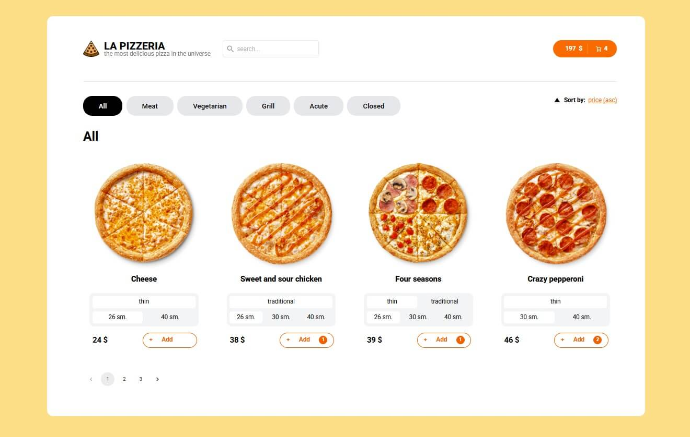

<p align="center">
  
</p>

# 🍕 La Pizzeria

**La Pizzeria** is a modern single-page pizza ordering application featuring a responsive interface, interactive cart, step-by-step order process, and real-time pricing.

[🌐 Live Demo](https://la-pizzeria-yurii-dano.vercel.app/)

---

## 📽️ Live Preview


---

## 📸 Screenshots

### 🏠 Home Page


### 🛒 Cart Page


### 🧾 Order Form


### 🍕 Pizza Details


---

## 🚀 Features

- 📦 Cart with add/edit/remove functionality
- 🧾 Step-by-step modal order form with progress indicator
- 💾 LocalStorage for form data, cart, and order step
- 💸 Real-time pizza price updates based on crust and size
- ↕️ Sort by alphabet, rating, type and price
- 🔎 Optimized search input using `lodash.debounce` to reduce server requests and unnecessary re-renders
- 🔃 Lazy loading for Cart and Pizza pages
- 🌐 API integration using [MockAPI](https://mockapi.io/)
- 🧑‍💻 Fully responsive and mobile-friendly design

---

## 🛠️ Tech Stack

- **React**
- **Redux Toolkit** + **RTK Query**
- **React Router**
- **Axios**
- **React Hook Form**
- **Tailwind CSS**
- **Material UI**
- **TypeScript**
- **Vite**

---

## 💡 Highlights

- Dynamic pricing logic with instant updates
- Modal-based step-by-step order form with progress tracking
- All state persisted with LocalStorage (form, cart, step)
- Optimized initial loading by lazy loading the Cart and Pizza pages
- Modern, responsive user interface built with Tailwind CSS

---

## 🌐 SEO & Indexing

- Custom `sitemap.xml` and `robots.txt`
- Site registered and verified in [Google Search Console](https://search.google.com/search-console)
- Meta tags for SEO (`title`, `description`, `viewport`)
- OG tags for social media (`og:title`, `og:image`, `og:description`)

---

## 📁 Project Structure

src/
├── assets/     # Icons and images
├── components/ # UI building blocks
├── pages/      # App pages (Home, Cart, Pizza, NotFound, CartEmpty)
├── redux/      # Store, slices, RTK Query
├── api/        # API calls and services
├── utils/      # Helpers and logic
├── types/      # TypeScript types

---

## 🧪 Run Locally

```bash
git clone https://github.com/yuriidano/la-pizzeria.git
cd la-pizzeria
npm install
npm run dev


## 🔗 Links

- 🔴 [Live App on Vercel](https://la-pizzeria-yurii-dano.vercel.app/)
- 📦 [GitHub Repository](https://github.com/yuriidano/la-pizzeria)


---

> Built with 💛 by [Yurii Dano](https://github.com/yuriidano) — created as a portfolio project.
